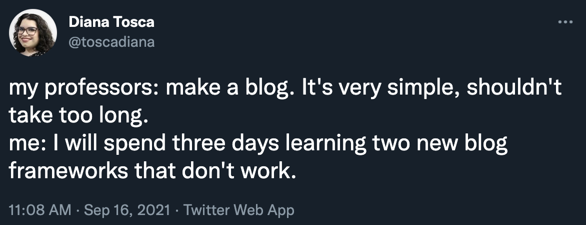

As a young artist who has made the mistake of never documentaing anything, I was glad that all my professors decided to mandate having process blogs for class. 

Except, of course, I had to go and overcomplicate things.

<!--  -->

I didn't want to make a Wordpress blog, because I don't know anything about Wordpress. 

I didn't want to use Medium, because I think it's too messy to manage three different blogs on a single site.

So I opted to go for a Jekyll blog hosted on GitHub pages. After all, [I've done it before](https://undenailable.github.io/), so it would be simple.

Except, in the world of programming, nothing is ever straightforward!

So, I spent three days debugging, ended up learning a different blog framework, and I still don't know how to add image files in markdown. But, here I am!

I hope this doesn't foreshadow how the entire class will go. :)

Conclusion: yay, it works!

